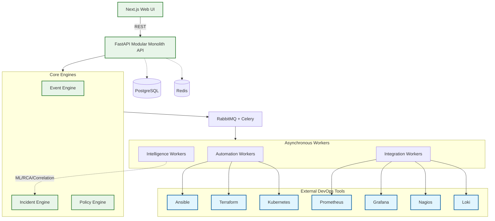

# InfraPilot

**InfraPilot** is an independent infrastructure operations control plane designed to unify infrastructure inventory, observability, alert ingestion, incident management, and automated remediation.

## 🎯 Goal of the Application
The primary goal of InfraPilot is to serve as a **centralized orchestrator** for modern infrastructure. 
It is **NOT** a replacement for underlying DevOps execution and monitoring tools. Instead, it sits as a unified orchestration layer above them, providing:
- Centralized ingestion and normalization of alerts.
- Cross-system incident correlation and intelligence.
- Policy-controlled automation with human approvals.
- Full closed-loop resolution including verification and auditing.

### 🛠️ DevOps Tools Focus
This application mainly focuses on orchestrating and integrating with industry-standard **DevOps tools**, including but not limited to:
- **Monitoring & Observability**: Prometheus, Grafana, Alertmanager, Nagios, Loki
- **Infrastructure as Code**: Terraform
- **Configuration Management**: Ansible, Puppet
- **Container Orchestration**: Kubernetes, Docker

## 🚀 Current Stage
**Current Status: PHASE_1.8_IMPLEMENTED**

The core foundation, backend architecture, and robust event/incident pipelines have been completely implemented and verified up to **Phase 1.8**. We are currently moving into **Phase 1.9 (Event Processing Hardening & Operational Intelligence Foundation)**.

Completed features include:
- Modular Monolith API with FastAPI.
- Relational state management with PostgreSQL, SQLAlchemy, and Alembic.
- Security boundary with JWT, Argon2id, RBAC, and Audit Logging.
- Provider Adapter and Integration Framework.
- Asynchronous Task Workers with Celery and RabbitMQ.
- Raw Event Ingestion, Alert Normalization, and deterministic Incident Correlation.

## 🏗️ Architecture Structure

